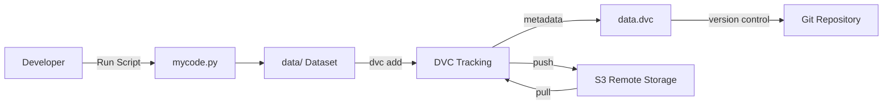
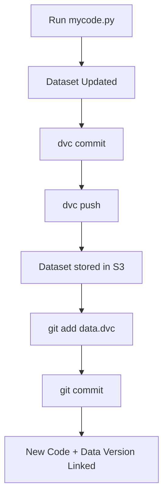

# 🚀 ML-OPS-DVC-DataVersion-Trial


A minimal project demonstrating how to **decouple source code from datasets using DVC (Data Version Control)**.

This repository shows how **Git and DVC work together** to manage machine learning data pipelines.

* Git → tracks **code and metadata**
* DVC → tracks **large datasets**
* Remote storage → stores **actual data**

---

# 📌 Project Objective

Machine learning projects face several common problems:

* Large datasets cannot be efficiently stored in Git
* Data evolves continuously
* Reproducing previous experiments becomes difficult

**DVC solves this by enabling:**

* Dataset versioning
* External data storage
* Reproducibility
* Data lineage tracking

This repository demonstrates a **simple ML-Ops style data versioning workflow**.

---

# ☁️ Storage Simulation

To avoid cloud configuration complexity, this project simulates **AWS S3 storage**.

Instead of a real bucket, we use a local folder:

```
S3/
```

This acts as a **mock remote storage backend** so we can still run:

```
dvc push
dvc pull
```

without requiring AWS credentials.

---

# 🏗 Architecture Diagram

The system architecture shows how **Git, DVC, and remote storage interact**.



### Architecture Explanation

| Component   | Role                          |
| ----------- | ----------------------------- |
| `mycode.py` | Generates or updates dataset  |
| `data/`     | Actual dataset                |
| `data.dvc`  | Metadata pointer to dataset   |
| Git         | Tracks code + dataset pointer |
| DVC         | Manages dataset versions      |
| `S3/`       | Simulated remote storage      |

---

# 🛠 Workflow Overview

This project follows a **Git + DVC hybrid lifecycle**.

1. Initialize repository
2. Move dataset tracking from Git to DVC
3. Version datasets using a double commit system

---

# 1️⃣ Initialization

Initialize DVC and configure remote storage.

```bash
pip install dvc
dvc init

mkdir S3
dvc remote add -d myremote S3
```

At this stage:

* Git tracks everything
* DVC is configured

---

# 2️⃣ Handing Data to DVC

Remove dataset tracking from Git.

```bash
git rm -r --cached data
git commit -m "Stop tracking data via Git"
```

Add dataset to DVC.

```bash
dvc add data/
```

Track metadata with Git.

```bash
git add .gitignore data.dvc
git commit -m "Start tracking data via DVC"
```

Now:

```
Git → metadata
DVC → actual dataset
```

---

# 🔁 Dataset Versioning Loop

Each dataset update follows a **double commit cycle**.

---

## Step 1 — Modify Dataset

Run the script.

```bash
python mycode.py
```

This modifies:

```
data/dataset.csv
```

---

## Step 2 — Update DVC

```bash
dvc commit
dvc push
```

Purpose:

| Command      | Purpose                  |
| ------------ | ------------------------ |
| `dvc commit` | Update DVC cache         |
| `dvc push`   | Upload dataset to remote |

---

## Step 3 — Update Git Pointer

```bash
git add data.dvc
git commit -m "Update dataset version"
```

Git now records the **pointer to the dataset version**.

---

# 🔄 Workflow Diagram

The complete lifecycle of dataset updates.



---

# 🕒 Version Recovery (Time Travel)

Because Git stores dataset pointers, we can recover **previous dataset versions**.

---

## Step 1 — Find Commit

```bash
git log --oneline
```

Example:

```
c1a2b3 Dataset V3
a1b2c3 Dataset V2
f3e2d1 Dataset V1
```

---

## Step 2 — Checkout Version

```bash
git checkout <commit-hash>
```

Example:

```bash
git checkout a1b2c3
```

---

## Step 3 — Pull Matching Dataset

```bash
dvc pull
```

DVC reads the `data.dvc` file from that commit and restores the dataset.

---

# 🔁 Return to Latest Version

```bash
git checkout main
dvc pull
```

---

# 📂 Project Structure

```
ML-OPS-DVC-DataVersion-Trial
│
├── data/
│   └── dataset.csv
│
├── data.dvc
│
├── S3/
│   └── simulated remote storage
│
├── .dvc/
│   └── configuration and cache
│
├── mycode.py
│
└── README.md
```

---

# 🧠 Concepts Demonstrated

This project highlights important **MLOps practices**.

### Data Versioning

Track dataset changes across versions.

### Code–Data Decoupling

Separate code storage from dataset storage.

### Reproducibility

Reproduce experiments using exact dataset versions.

### Data Lineage

Understand how datasets evolved.

### Git + DVC Integration

Combine software engineering and data engineering workflows.

---

# 🔮 Future Improvements

This project can evolve into a **complete ML pipeline**.

Possible upgrades:

* DVC Pipelines
* Model Versioning
* Experiment Tracking
* CI/CD for ML
* Real cloud storage (AWS S3 / GCS / Azure)

---

# 📚 References

DVC Documentation
https://dvc.org/doc

DVC Getting Started
https://dvc.org/doc/start

Data Versioning Guide
https://dvc.org/doc/use-cases/versioning-data-and-models

---

⭐ If you found this useful, consider starring the repository.
